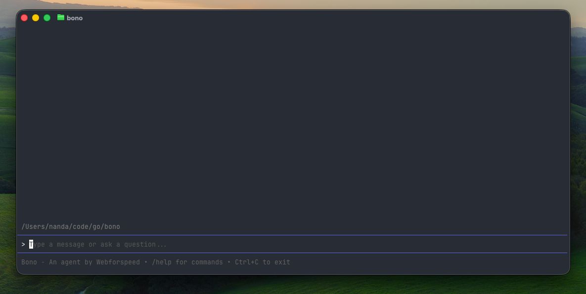

# Bono - By Webforspeed

Bono is a terminal-based AI coding agent (like Claude Code or Cursor) that autonomously reads, writes, edits, and manages code, runs shell commands, and helps automate complex development workflows—all from your command line.



## Features

- [x] Autonomous agent loop with tool-call execution
- [x] Built‑in file tools (read/write/edit)
- [x] Shell execution with user approvals
- [x] Auto-exploring agent (generates AGENT.md on first run)
- [x] Agent config files (AGENT.md)
- [ ] Worktree‑isolated runs (disposable workspaces)
- [ ] Sandboxed execution (FS/command restrictions)
- [ ] Skills system (prompt/tool bundles)
- [ ] MCP tool integrations
- [ ] Slash commands (built-in + user-defined)
- [ ] Plan mode (preview and approve steps before execution)
- [ ] Sub-agents (delegate subtasks to child agents)
- [ ] Parallel tool execution (concurrent tool calls)

## Dependencies

This CLI is built on [bono-core](https://github.com/webforspeed/bono-core), which provides the autonomous agent loop, API client, and tool execution.

## Installation

```bash
go install github.com/webforspeed/bono@latest
```

Or build from source:

```bash
git clone https://github.com/webforspeed/bono.git
cd bono
go build .
```

## Configuration

Create a `.env` file in your working directory:

```env
# .env.example
OPENROUTER_API_KEY=your-api-key-here
BASE_URL=https://openrouter.ai/api/v1
MODEL=anthropic/claude-opus-4.5
```

Or set environment variables directly in your shell.

## Usage

```bash
./bono
```

Then type your prompts at the `>` prompt.

### Exploring Agent

On the first chat message, an exploring agent automatically runs to analyze your project and create an `AGENT.md` file. This file contains:

- Project structure and entry points
- Conventions and patterns
- Rules (always/never/style guidelines)
- Tips for finding things

The main agent reads `AGENT.md` at the start of each session to understand your project context.

### Tool Confirmations

| Tool | Confirmation |
|------|--------------|
| `read_file` | Auto-approved |
| `write_file` | Enter to confirm, Esc to cancel |
| `edit_file` | Enter to confirm, Esc to cancel |
| `run_shell` | Enter to confirm, Esc to cancel |

### Keyboard Shortcuts

| Key | Action |
|-----|--------|
| `Enter` | Approve tool execution |
| `Esc` | Cancel tool execution |
| `Ctrl+C` | Exit the agent |

## Quirks

What makes this different from other open source agents:

- **Self-documenting**: The agent automatically creates and maintains an `AGENT.md` file with project context. This runs as a separate sub-agent with its own context window, so the main agent doesn't suffer from context rot as the conversation grows.

- **Hook-based architecture**: The core agent exposes hooks (`OnToolCall`, `OnToolDone`, `OnMessage`, etc.), making it easy to build any frontend on top—this TUI is just one example.

- **Model agnostic**: Uses OpenRouter as the backend, so you can swap models freely. Claude, GPT-4, Gemini, Llama, Mistral—whatever works for your use case.

- **Transparent tool calls**: Every tool includes a plain-English description and a required `safety` classification (`read-only`, `modify`, `destructive`, `network`, `privileged`). You always know what the agent is about to do before approving.

- **Self-correcting**: The agent is eager to verify its work and validate after every mutation—commands, file changes, or tasks. This feedback loop lets it catch mistakes early and keep iterating until the goal is actually complete.

## Local Development

To develop bono and bono-core together, add a replace directive to `go.mod`:

```go
replace github.com/webforspeed/bono-core => ../bono-core
```

Then run:

```bash
go mod tidy
go build .
```
