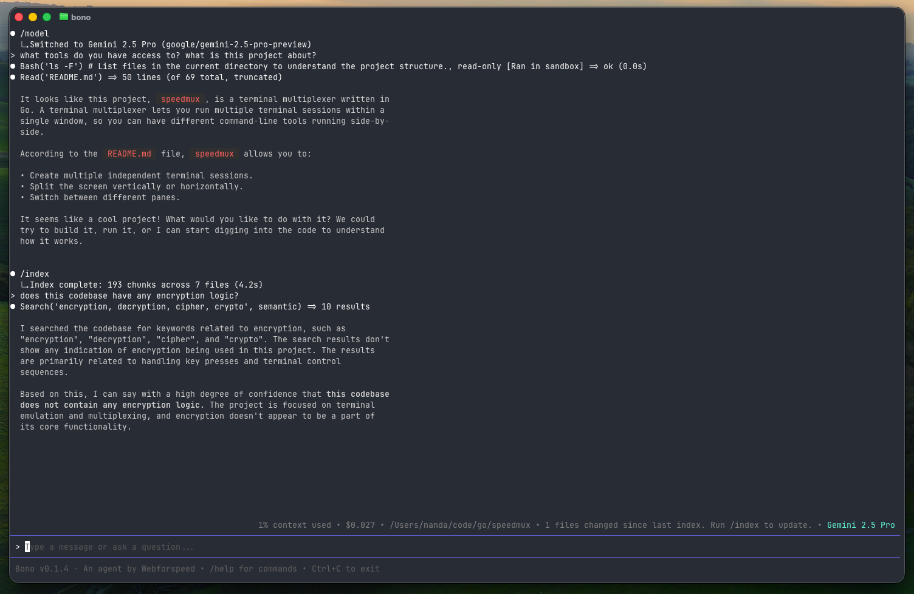

# bono - An autonomous agent in the terminal

A terminal coding agent frontend written in Go. Bono provides the TUI, slash-command UX, and tool approval flow, while `bono-core` handles the agent loop and tool execution.

## Screenshot


## Features
- **Slash:** Slash-command-first UX (`/init`, `/index`, `/model`, `/spinner`, `/clear`, `/help`, `/exit`)
- **BYOK:** OpenRouter BYOK support via `OPENROUTER_API_KEY`
- **Search:** Semantic code search with vector indexing and repo stats in the status row
- **Chunking:** AST-based chunking/indexing pipeline (powered by `bono-core`)
- **Sandbox:** Default sandboxed command execution with approval fallbacks for unsandboxed runs
- **Runtime:** Programmatic tool calling with `python_runtime` for complex multi-step workflows that save context window
- **Compaction:** Intelligent context compaction to reduce risk of hitting context limits
- **Telemetry:** Live context and cost telemetry in the TUI
- **Models:** Switch LLMs at runtime via slash command (`/model`)
- **Reasoning:** Configurable reasoning effort via `/reasoning` — supports `minimal`, `low`, `medium`, `high`, and `xhigh` levels.
- **Streaming:** Live token-by-token response streaming with real-time reasoning and content deltas
- **Web:** Live web access via `WebSearch` (search mode returns ranked URLs, answer mode returns a synthesized answer with citations) and `WebFetch` (reads and summarizes a URL). Auto-routes between modes using a fast LLM classifier; model can override with `mode="search"` or `mode="answer"`

## Tools
- `read_file`: read file contents
- `write_file`: write full file contents
- `edit_file`: apply focused file edits
- `run_shell`: run shell commands (sandbox-aware)
- `python_runtime`: execute Python snippets (sandbox-aware)
- `code_search`: semantic/hybrid/exact code search
- `web_search`: live web search — returns ranked URLs (search mode) or synthesized answer with citations (answer mode); auto-classified if mode omitted
- `web_fetch`: fetch and summarize a URL, optionally focused on a specific question
- `compact_context`: compact long conversation context

## Install (GitHub Releases)
Install the latest release with:

```bash
curl -fsSL https://raw.githubusercontent.com/webforspeed/bono/main/install | bash
```

This installs `bono` to `~/.local/bin/bono`.

## Local Install / Deploy
Build and install from source:

```bash
make deploy
```

By default this installs `bono` to `~/.local/bin/bono`. If `~/.local/bin` is not on your `PATH`, add this to your shell config (`~/.zshrc`, `~/.bashrc`, etc.):

```bash
export PATH="$HOME/.local/bin:$PATH"
```

## Publishing Releases
Tag pushes matching `v*` trigger `.github/workflows/release.yml`.

Example:

```bash
make release TAG=v0.1.0
```

## Run

```bash
go run .
```

## Slash Commands
- `/init`: run exploring agent
- `/index`: index codebase for semantic search
- `/help`: show commands
- `/clear`: clear chat history and reset cost/context meter
- `/model`: open model selector
- `/reasoning`: open reasoning effort picker (or set directly: `/reasoning high`, `/reasoning none`)
- `/spinner`: cycle spinner style (or set explicit type)
- `/exit`: exit Bono

## Notes
- `OPENROUTER_API_KEY` is required.
- Bono status footer shows build mode/version: `Bono (dev)` for local builds and `Bono vX.Y.Z` for release builds.
- Bono checks GitHub releases in the background and shows `new version available` in the footer for newer tags.
- Set `BONO_DISABLE_UPDATE_CHECK=1` to skip update checks.
- Bono repo owns TUI and UX behavior; `bono-core` owns agent loop, tools, and web/tool internals.
