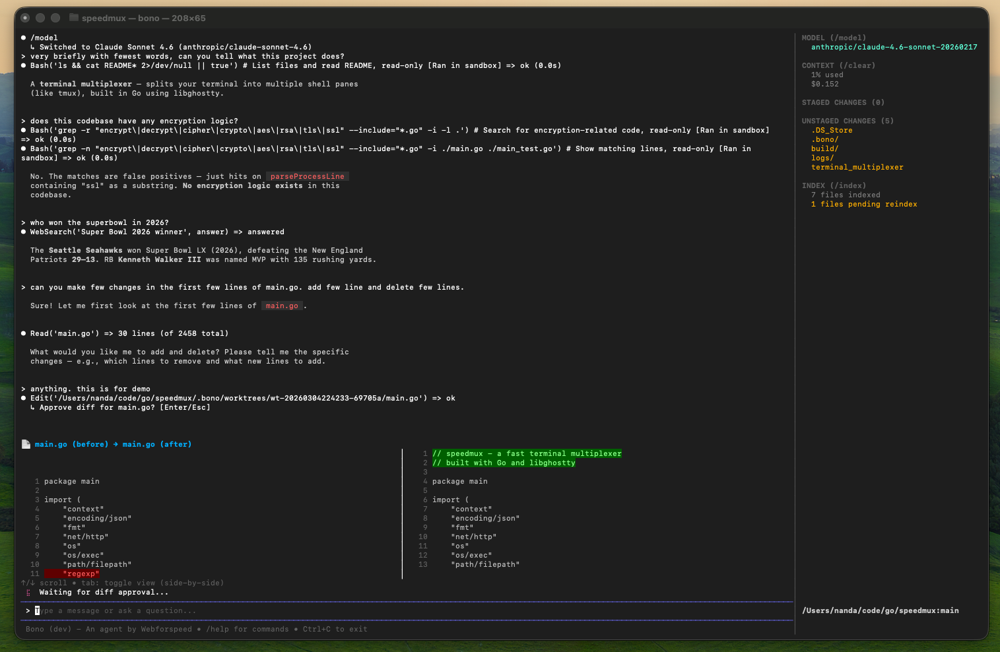

# bono - An autonomous agent in the terminal

A terminal coding agent frontend written in Go. Bono provides the fullscreen TUI, the headless prompt mode, shared session frontends, and the user-facing approval flow, while `bono-core` handles the agent loop and tool execution.

## Screenshot


## Slash Commands

| Command | Description |
|---------|-------------|
| `/index` | Index codebase for semantic code search |
| `/plan` | Launch a planning subagent with its own context window to think through architecture and approach |
| `/reasoning` | Set reasoning effort (`minimal`, `low`, `medium`, `high`, `xhigh`) |
| `/model` | Switch LLM at runtime |
| `/clear` | Clear conversation history and reset cost/context meter |

## Features
- **Modes:** Fullscreen TUI by default, plus headless prompt mode via `bono -p "..."` / `bono --prompt "..."`.
- **Slash:** Slash-command-first UX (`/init`, `/index`, `/model`, `/spinner`, `/clear`, `/help`, `/exit`)
- **BYOK:** OpenRouter BYOK support via `OPENROUTER_API_KEY`
- **Search:** Semantic code search with vector indexing and repo stats in the status row
- **Chunking:** AST-based chunking/indexing pipeline (powered by `bono-core`)
- **Sandbox:** Default sandboxed command execution with approval fallbacks for unsandboxed runs
- **Runtime:** Programmatic tool calling with `python_runtime` for complex multi-step workflows that save context window
- **Compaction:** Intelligent context compaction to reduce risk of hitting context limits
- **Telemetry:** Live context and cost telemetry in the TUI, with shared session events available to headless and future frontends
- **Models:** Switch LLMs at runtime via slash command (`/model`)
- **Reasoning:** Configurable reasoning effort via `/reasoning` — supports `minimal`, `low`, `medium`, `high`, and `xhigh` levels.
- **Streaming:** Live token-by-token response streaming with real-time reasoning and content deltas
- **Web:** Live web access via `WebSearch` (search mode returns ranked URLs, answer mode returns a synthesized answer with citations) and `WebFetch` (reads and summarizes a URL). Auto-routes between modes using a fast LLM classifier; model can override with `mode="search"` or `mode="answer"`
- **Planning:** Dedicated planning subagent mode (`/plan`) for thinking through architecture and breaking down tasks before writing code

## Tools
- `read_file`: read file contents
- `write_file`: write full file contents
- `edit_file`: apply focused file edits
- `run_shell`: run shell commands (sandbox-aware)
- `python_runtime`: execute Python snippets (sandbox-aware)
- `code_search`: semantic/hybrid/exact code search
- `web_search`: live web search — returns ranked URLs (search mode) or synthesized answer with citations (answer mode); auto-classified if mode omitted
- `web_fetch`: fetch and summarize a URL, optionally focused on a specific question
- `compact_context`: compact long conversation context

## Install (GitHub Releases)
Install the latest release with:

```bash
curl -fsSL https://raw.githubusercontent.com/webforspeed/bono/main/install | bash
```

This installs `bono` to `~/.local/bin/bono`.

## Local Install / Deploy
Build and install from source:

```bash
make deploy
```

By default this installs `bono` to `~/.local/bin/bono`. If `~/.local/bin` is not on your `PATH`, add this to your shell config (`~/.zshrc`, `~/.bashrc`, etc.):

```bash
export PATH="$HOME/.local/bin:$PATH"
```

## Publishing Releases
Tag pushes matching `v*` trigger `.github/workflows/release.yml`.

Example:

```bash
make release TAG=v0.1.0
```

## Run

```bash
go run .
```

Run a single prompt in headless mode:

```bash
go run . -p "Find and fix the bug in auth.py"
```

Installed binary usage:

```bash
bono -p "Find and fix the bug in auth.py"
```

## Notes
- `OPENROUTER_API_KEY` is required.
- Set `SHELL_TIMEOUT_SEC` to change the default timeout for `run_shell` and `python_runtime` commands.
- Bono status footer shows build mode/version: `Bono (dev)` for local builds and `Bono vX.Y.Z` for release builds.
- Bono checks GitHub releases in the background and shows `new version available` in the footer for newer tags.
- Set `BONO_DISABLE_UPDATE_CHECK=1` to skip update checks.
- In headless mode, Bono streams the same session events into the terminal transcript and uses inline approval prompts like `Approve? [y/N]`.
- Bono repo owns terminal-facing UX behavior and session frontends; `bono-core` owns agent loop, tools, and web/tool internals.

## Vision and Philosophy
Bono is built around a simple thesis: the best coding agents do not need heavy scaffolding, sprawling configuration, or vendor lock-in. Models are already highly capable and getting better quickly, so the harness should stay small, portable, and opinionated only where it meaningfully improves the experience.

- **Minimal top-level system prompt:** The main agent runs on a deliberately small system prompt (~[100 tokens](./prompts/versions/v1.0.5.tmpl)) so the model does the heavy reasoning rather than following a script. Less scaffolding also means behavior stays portable across models — what works on one capable model should work on another without prompt surgery.
- **Targeted subagent prompts:** Subagents are different. Because each one has a narrow, well-defined job — planning architecture, executing a focused search, producing a structured output — they get a tight, task-specific system prompt that keeps them on-track without the overhead of general-purpose reasoning context. The philosophy isn't "always minimal" — it's *right-sized*: lean at the top where generality matters, precise at the edge where outcomes are specific.
- **Single-binary experience:** The logic and scaffolding needed to operate Bono should ship in one binary. You should not need to configure the agent to search for skills in special directories, depend on tools that may or may not be installed, or edit obscure config files just to get productive.
- **Minimal tool surface:** More tools are not always better. Every tool adds context and decision overhead, so Bono prefers a small set of tools that models actually use well instead of bloating the context window with rarely used capabilities.
- **Multi-host future:** Bono is not just a CLI idea. The goal is for the same agent experience to be available across multiple surfaces, including the terminal, desktop apps, extensions, mobile apps, and the web.
- **Model and vendor freedom:** Bono should work with any capable model, including locally hosted models, and should never be restricted to a single vendor.
